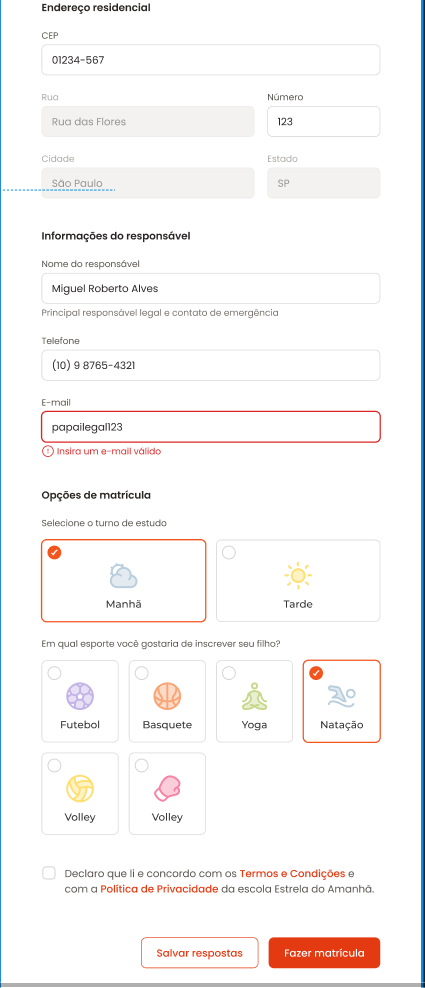

# ⭐ Estrelas do Amanhã





Projeto de um **formulário de matrícula escolar** desenvolvido com foco em **HTML5, CSS3 e JavaScript**, simulando o processo de inscrição de crianças na escola de educação infantil **Estrelas do Amanhã**.

O layout foi pensado para ser moderno, acessível e intuitivo, com organização clara das informações e uma experiência amigável para pais ou responsáveis.

---

## 🧒 Sobre o projeto

O formulário permite o cadastro completo de um aluno, incluindo:

- Informações pessoais da criança  
- Dados médicos importantes  
- Upload de documentos  
- Endereço residencial  
- Informações do responsável  
- Escolha de turno e atividades esportivas  
- Aceite de termos e condições  

Tudo isso organizado em **fieldsets**, melhorando a semântica e a usabilidade.

---

## ✨ Funcionalidades

- Campos obrigatórios com validação
- Upload de arquivos (certidão de nascimento)
- Seleção de turno (manhã / tarde)
- Escolha de esportes extracurriculares
- Layout responsivo
- Estilização personalizada de inputs, radios e checkbox
- Feedback visual para erros (ex: e-mail inválido)

---

## 🛠️ Tecnologias utilizadas

- HTML5  
- CSS3  
- JavaScript  
- Google Fonts (Roboto Condensed)

---

## 📂 Estrutura do projeto

```text
├── index.html
├── styles/
│   └── index.css
├── assets/
│   ├── icons/
│   ├── images/
│   └── Illustration.svg
├── script.js
└── README.md
